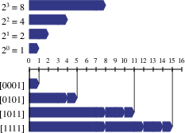
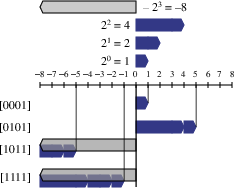
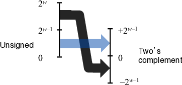
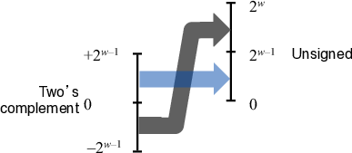
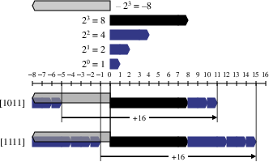
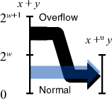
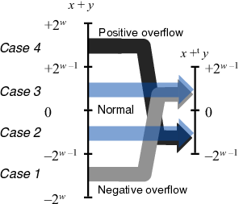

# Representing and Manipulating Information
CS:APP3e.ch02

Bits, Bytes, and Integers
---

## Information Storage
- Computers access memory in **bytes (8 bits)** rather than individual bits, 
  - with each byte identified by a unique **address** in virtual memory.  
- **Virtual address space** is a conceptual view presented to programs, 
  - created by combining DRAM, flash memory, disk storage, hardware, and OS software.  
- Memory is partitioned by the compiler and runtime system 
  - to store **program data, instructions, and control information** within the virtual address space.  
- Pointers in C represent the **virtual address of a memory block**, 
  - with type information managed by the compiler, 
  - while `machine-level code` views all data as `byte sequences`.
- 📝 View memory and disk storage with [HxD](https://mh-nexus.de/en/hxd/)
- 📝 Explore processes with [Process Explorer](https://learn.microsoft.com/en-us/sysinternals/downloads/process-explorer)
  - 📝 View process code with [x64dbg](https://x64dbg.com/)

---

## Hexadecimal Notation
- A byte (8 bits) ranges from **0 to 255 (decimal)** or **00 to FF (hexadecimal)**, 
  - with hex providing a concise way to represent bit patterns.  
- In C, **hexadecimal numbers** start with `0x` or `0X` and can use uppercase or lowercase 
  - e.g., `0xFA1D37B` or `0xfa1d37b`.  
- Converting between **binary and hex** is simple, done digit by digit, 
  - often using charts or memorized values for key hex digits.
- 📝 Find the mappings between binary, octal, decimal, and hex
  ```python
  # Print table headers
  print(f"{'Decimal':<10}{'Binary':<10}{'Octal':<10}{'Hexadecimal':<10}")
  print("-" * 40)

  # Print values from 0 to 15
  for i in range(16):
      print(f"{i:<10}{bin(i)[2:].zfill(4):<10}{oct(i)[2:]:<10}{hex(i)[2:].upper():<10}")
  ```

--- 

## The Mappings Between Binary, Octal, Decimal, and Hex

| Decimal  | 0 | 1 | 2 | 3 | 4 | 5 | 6 | 7 | 8 | 9 | 10| 11| 12| 13| 14| 15|
|-------|---|---|---|---|---|---|---|---|---|---|---|---|---|---|---|---|
| Binary| 0000 | 0001 | 0010 | 0011 | 0100 | 0101 | 0110 | 0111 | 1000 | 1001 | 1010 | 1011 | 1100 | 1101 | 1110 | 1111 |
| Octal | 0 | 1 | 2 | 3 | 4 | 5 | 6 | 7 | 10| 11| 12| 13| 14| 15| 16| 17|
| Hex   | 0 | 1 | 2 | 3 | 4 | 5 | 6 | 7 | 8 | 9 | A | B | C | D | E | F |

- Machine code are represented as byte sequences
  - each byte is represented by two hex digits
- 📝 View machine code
  ```bash
  objdump -d $(which objdump)
  ```

---

## Data Sizes
- Word size determines the maximum virtual address space, 
  - 32-bit machines having a 4GB limit 
  - 64-bit machines supporting up to 16 exabytes.
- 64-bit machines can run both 32-bit and 64-bit programs, 
  - depending on how the program is compiled.
- C language supports multiple data formats and sizes for integers and floating-point types, 
  - integer types available in signed and unsigned variants.
- Programmers should use fixed-size types like `int32_t` and `int64_t` for portability, 
  - ensure programs handle differences in data type sizes across platforms.

---

## Example Data Representations

| Data Type | char | short | int | long | float | double | long double | pointer |
|----|------|-------|-----|------|-------|-----|----|-----|
| Typical 32-bit| 1| 2 | 4   | 4| 4 | 8  | —   | 4   |
| Typical 64-bit| 1| 2 | 4   | 8| 4 | 8  | —   | 8   |
| x86-64| 1| 2 | 4   | 8| 4 | 8  | 10/16  | 8   |

- 📝 Review C/C++ [types](./code/cct.c)

---

## Addressing and Byte Ordering

- Multi-byte objects have a memory address given by the `smallest byte's address`  with bytes stored contiguously in two byte ordering
  - `little-endian` (`least` significant byte first), typically used by Intel-compatible machines
  - `big-endian` (`most` significant byte first), typically used by IBM/Oracle machines
  - some processors are bi-endian, such as ARM

- `x = 0x12345678` memory layout

| Address <br> `&x`    | 0 | 1 | 2 | 3 |
|--------------|-------|-------|-------|-------|
| Little-Endian| 0x78  | 0x56  | 0x34  | 0x12  |
| Big-Endian   | 0x12  | 0x34  | 0x56  | 0x78  |


- Byte ordering is crucial in 
  - low-level programming for data transfer between machines with different endianness, 
  - integer representation in machine-level code

---

## 📝 Practice: Endianness Conversion
- ➊ In Python
  ```python
  import struct
  import binascii

  little_endian = struct.pack('<I', 0x12345678)
  big_endian = struct.pack('>I', 0x12345678)
  hex_little = binascii.hexlify(little_endian).decode()
  hex_big = binascii.hexlify(big_endian).decode()
  print(f'big_endian:{hex_big}, little_endian:{hex_little}')
  ```

- ➋ In C, [showmem.c](./code/showmem.c)
  ```bash
  # compile the source code
  gcc showmem -o showmem

  # show typical types
  ./showmem  21930 short
  ./showmem  305419896 int
  ./showmem 1311768465155175236 "long long"
  ./showmem 0x1122334455667788 pointer

  ./showmem 3.14 float
  ./showmem 3.14 double
  ./showmem 3.14 "long double"
  ```
---

## Representing Text
- `Strings in C` are arrays of characters terminated by a null byte (0), 
  - typically encoded in `ASCII`, 
  - ensuring platform independence for text data,
  - limited for encoding non-Latin scripts. 
- `Unicode`, with over 100,000 characters, provides a comprehensive standard supporting global languages.  
  - includes ancient scripts but rejected fictional scripts like Klingon from Star Trek.  
- `UTF-8` encoding allows compatibility with ASCII, 
  - using 1 byte for common characters and more for rarer ones, 
  - ensuring efficient text representation.

---

## Unicode Encoding
| Encoding  | Description  | Byte Length<br>per character  | Compatibility| Use Case |
|---|---|------|---|----|
| **UTF-8** | Variable-length encoding    | 1 to 4 bytes | Backward compatible with ASCII | Web, text files, most common encoding|
| **UTF-16**| Variable-length encoding    | 2 or 4 bytes | Compatible with UCS-2| Windows, Java, used for internal processing|
| **UTF-32**| Fixed-length encoding  | 4 bytes | Direct mapping to Unicode code points  | Rare, used in specialized applications    |

- 📝 Practice: unicode encoding demo
  - in [Python](./code/ue.py)
  - in [C](./code/ue.c)
- 👉 more on [unicode](./unicode.md)

---

## Review: C/C++ bit-level operations
- Bitwise operations are commonly used in low-level programming, embedded systems, and performance optimization.
- Apply to `any integral` data type: long, int, short, char, unsigned
- Arguments viewed as bit vectors and applied bit-wise

| Operator | Name | Description | Example   |
|---|----|-----|---|
| `&` | Bitwise AND| Sets each bit to 1 if both bits are 1  | `a & b`   |
| `\|` | Bitwise OR | Sets each bit to 1 if at least one bit is 1 | `a \| b`   |
| `^` | Bitwise XOR| Sets each bit to 1 if only one bit is 1| `a ^ b`   |
| `~` | Bitwise NOT (complement)  | Inverts all bits  | `~a` |
| `<<`| Left shift | Shifts bits to the left, filling with 0s    | `a << 2`  |
| `>>`| Right shift (logical)| Shifts bits to the right, filling with 0s (unsigned)  | `a >> 2`  |
| `>>`| Right shift (arithmetic)  | Shifts bits to the right, preserving sign bit (signed)| `b >> 2` (negative b)  |

- 📝 Practice
  - Compare bitwise operations with logic operations
  - Find the results for shift amount < 0 or ≥ word size
    - undefined behavior
  - Model sets with bit vectors and set operations with bitwise operations
    - n-bits vector values ↦  all subsets of n-elements set
    - `&` ↦ intersection, `|` ↦ union, `~` ↦ complement, `^` ↦ symmetric difference

---

## Integer Binary Representations
- Given bit pattern $\vec{b}=(b_{w-1},b_{w-2}, ⋯, b_1, b_0)$ of w-bits, $b_i$ as the bit at position $i$. The two popular integer encodings
  - $B2U_w: [0,1]^w → [0, UMax_w]$: bit pattern to unsigned integer
  - $B2T_w: [0,1]^w → [TMin_w, TMax_w]$: bit pattern to two's complement integer
  - Both are `one-to-one` or `bijection` functions so they are `invertible`
    - let $U2B_w = B2U_w^{-1}$ and $T2B_w = B2T_w^{-1}$ for reference below

| | Unsigned Representation | Signed Two's Complement Representation |
|---|---|---|
| Formula | $u_{\vec{b}} = B2U_w(\vec{b}) = b_{w-1} \cdot 2^{w-1} + \sum_{i=0}^{w-2} b_i \cdot 2^i$ | $s_{\vec{b}} = B2T_w(\vec{b}) = -b_{w-1} \cdot 2^{w-1} + \sum_{i=0}^{w-2} b_i \cdot 2^i$  |
| Range | $UMin_w=0$ to $UMax_w=2^w - 1$ | $TMin_w=-2^{w-1}$ to $TMax_w=2^{w-1} - 1$ |
| Illustration |  |  |

- $B2U_w(\vec{b}) = B2T_w(\vec{b}) + b_{w-1}⋅2^w$
  - $u_{\vec{b}} = s_{\vec{b}} + b_{w-1} ⋅ 2^w$
- **Unsigned values** are always non-negative
  - $UMax = 2TMax + 1$
- **Signed two's complement** can represent negative values by utilizing the MSB as a sign bit
  - provide a simple way to represent negative numbers and perform subtraction with addition
  - $|TMin|=TMax + 1$
- **Overflow** occurs if the result falls `outside of range`
- 📝 Practice: find the ranges of all C/C++ integer types
  - check your answers against `limits.h`, then with [cput.py](./code/cput.py)

---

## Two's Complement and Radix Complement
- The **two's complement** system is a specific case of **radix complement** for base-2 (binary) numbers.
- In general:
  - **Radix complement** for base-$`r`$ and $w$-digit number $N$ is:  
    $r^w - N$
  - **Diminished radix complement** (one less than the full complement):  
    $(r^w - 1) - N$
- In **binary (base-2)**, the `radix complement is 2's complement`
  - $2^w - N$ is the `2's complement encoding` of $-N$, i.e. the **negation** of $N$
  - ∴ $N$'s 2's complement encoding is $(2^w+N) \bmod 2^w$
- **Steps to compute two's complement of N**:
  1. **Find the one's complement** (diminished radix complement):  $(2^w - 1) - N$  
     - This inverts all bits (flip 1 to 0 and 0 to 1).     
  2. **Add 1** to get the full radix complement: $2^w - N = (2^w - 1 - N) + 1$

---

## Conversion and Casting in Theory
- Mappings between unsigned and two's complement numbers `keep bit representations and reinterpret`
  - signed $s_{\vec{b}}$ to unsigned $u_{\vec{b}}$: $s_{\vec{b}} \stackrel{T2B_w}{⟶} B \stackrel{B2U_w}{⟶}u_{\vec{b}}$
    - $u_{\vec{b}} = T2U_w(s_{\vec{b}})=s_{\vec{b}} + b_{w-1}2^w$
  - unsigned $u_{\vec{b}}$ to $s_{\vec{b}}$: $u_{\vec{b}} \stackrel{U2B_w}{⟶} B \stackrel{B2T_w}{⟶}s_{\vec{b}}$
    - $s_{\vec{b}} = U2T_w(u_{\vec{b}})=u_{\vec{b}} - b_{w-1}2^w$

| **Conversion**  | **Formula (Piece-wise Linear Function)** | **Illustration** |
|------------------------|-----------|-----|
| **Unsigned to Signed** | $`s_{\vec{b}} = \begin{cases} u_{\vec{b}} & \text{if } u_{\vec{b}} < 2^{w-1} \\ u_{\vec{b}} - 2^w & \text{if } u_{\vec{b}} \geq 2^{w-1} \end{cases}`$ |  |
| **Signed to Unsigned** | $`u_{\vec{b}} = \begin{cases} s_{\vec{b}} & \text{if } s_{\vec{b}} \geq 0 \\ s_{\vec{b}} + 2^w & \text{if } s_{\vec{b}} < 0 \end{cases}`$ | |


| Unsigned (4-bit) | Binary (4-bit) | Signed (4-bit) |
|------------------|----------------|-----------------|
| 0                | 0000           | 0               |
| 1                | 0001           | 1               |
| 2                | 0010           | 2               |
| 3                | 0011           | 3               |
| 4                | 0100           | 4               |
| 5                | 0101           | 5               |
| 6                | 0110           | 6               |
| 7                | 0111           | 7               |
| 8                | 1000           | -8              |
| 9                | 1001           | -7              |
| 10               | 1010           | -6              |
| 11               | 1011           | -5              |
| 12               | 1100           | -4              |
| 13               | 1101           | -3              |
| 14               | 1110           | -2              |
| 15               | 1111           | -1              |

- 
- 📝 Convert between unsigned and signed integer of width $w$ with [uvt.py](./code/uvt.py)

---

## Conversion and Casting in C/C++
- In C/C++, `constants` by default are considered to be `signed integers`
  - Unsigned if have “U” as suffix: 0U, 314U
  - Explicit casting between signed and unsigned same as U2T and T2U
  - ⚠️ Implicit casting also occurs via assignments and procedure calls
    - signed values implicitly cast to unsigned in single expression mixed with unsigned and signed
      - including comparison operations `<, >, ==, <=, >=`
  - Can have `unexpected effects: adding or subtracting` $2^w$
- 📝 Watch out [casting surprise](./code/surp.c)
- 📝 Find the vulnerabilities in the code below
  - [Old FreeBSD’s implementation of getpeername](./code/vul1.c)
  - [SUN XDR library function copy_elements](./code/vul2.c)

---

## Expanding and Truncating

- Expanding: `smaller` integer type of w-bit → `larger` integer type of (w+k)-bit
  - zero padded for unsigned: `1011` → `0000_1011`
    - $B2U_w(\vec{b}) = B2U_{k+w}((\underbrace{0}_{k},\vec{b}))$
  - sign bit padded for signed, called `sign extension`: 
    - `1011` → `1111_1011`, `0101` → `0000_0101`
    - $B2T_w(\vec{b}) = B2T_{k+w}(\underbrace{b_{w-1}}_{k},\vec{b}))$
    - automatically performed in C/C++
  - both yield expected result
- Truncating: `larger` integer type of w-bit → `smaller` integer type of k-bit
  - High bits are truncated and result is `reinterpreted`
    - Unsigned: mod operation 
      - $B2U_k((b_{k-1},b_{k-2}, ⋯, b_0)) = B2U_w((b_{w-1},b_{w-2}, ⋯, b_0)) \bmod 2^k$
    - Signed: mod as unsigned then reinterpret to be signed
      - $B2T_k((b_{k-1},b_{k-2}, ⋯, b_0)) = U2T_k(B2U_w((b_{w-1},b_{w-2}, ⋯, b_0)) \bmod 2^k)$
  - Small numbers yields expected behavior
- 📝 Watch out [exceptional behavior](./code/extr.c)
  - especially different representation

---

## Arithmetic Operations on Unsigned Numbers
- Let $x$ and $y$ be two unsigned $w$-bit integers,
- `Addition`: $`s ≐ x +_w^u y = \begin{cases} x+y, & x+y<2^w (\text{Normal})\\ x+y-2^w, & 2^w ≤ x+y ≤ 2^{w+1} (\text{Overflow}) \end{cases}`$
  - 
  - Overflow condition: $s < \min(x,y)$
- `Negation`: $`x' ≐ -_w^u x = \begin{cases} 0, & x=0\\ 2^w-x, & x>0 \end{cases}`$
  - prove by $x' +_w^u x = 0$, i.e. $x'$ is the `inverse` of $x$ under $-_w^u$.
- `Multiplication`: $x ×_w^u y = (x ⋅ y)\bmod 2^w$


- Unsigned arithmetic is straightforward but limited by the bit-width.  
  - Overflow and carry detection is crucial in low-level programming.  
  - Wrap-around behavior simplifies modular arithmetic.
- 📝 [un.c](./code/un.c) shows arithmetic operations on `unsigned char` in C.
  - Extend it to other C unsigned integer types.

---

## Arithmetic Operations on Signed Two's Complement Numbers
- Two’s complement representation in $w$-bits for $N$: 
  - $(2^w+N) \bmod 2^w$
- Let $x$ and $y$ be two $w$-bit signed integers:
- `Addition`: $`s ≐ x +_w^t y = \begin{cases} x+y-2^w, & 2^{w-1} ≤ x+y (\text{Positive overflow})\\ x+y, & -2^{w-1} ≤ x+y < 2^{w-1} (\text{Normal}) \\ x+y+2^w, & x+y<-2^{w-1} (\text{Negative overflow}) \end{cases}`$
  - $x +_w^t y = U2T_w((x+y)\bmod 2^w)$
  - 
  - Positive overflow if $x>0$ and $y>0$ but $s≤0$,
  - Negative overflow if $x<0$ and $y<0$ but $s≥0$.
- Overflow leads to wrapping around to the opposite end of the number line.  For $w$-bit numbers:
  - Positive overflow results in a large negative value.  
  - Negative overflow results in a large positive value.
- `Negation`: $`x' ≐ -_w^t x = \begin{cases} TMin_w, & x=TMin_w\\ -x, & x>TMin_w \end{cases}`$
  - prove by $x' +_w^t x = 0$, i.e. $x'$ is the `inverse` of $x$ under $-_w^t$.
- `Multiplication`: $x ×_w^t y = U2T_w((x ⋅ y)\bmod 2^w)$
  - backed by $T2B_w(x ×_w^t y) = U2B_w(u_x ×_w^u u_y)$, where
  - $x=B2T_w(\vec{x}),\ y=B2T_w(\vec{y}),\ u_x=B2U_w(\vec{x}),\ u_y=B2U_w(\vec{y})$
- 📝 [sign.c](./code/sign.c) shows arithmetic operations on `signed char` in C.
  - Extend it to other C signed integer types.

---

## Comparison
- TAdd and UAdd have identical bit-level behavior
  ```c
  int s, t, u, v;
	s = (int) ((unsigned) u + (unsigned) v);
 	t = u + v
  // t==s
  ```
  - Unsigned: addition mod $2^w$
    - Mathematical addition + possible subtraction of $2^w$
  - Signed: modified addition mod $2^w$ (result in proper range)
    - Mathematical addition + possible addition or subtraction of $2^w$
- TMult and UMult use normal multiplication followed by truncate
  - same operation on bit level
  - Unsigned: multiplication mod $2^w$
  - Signed: modified multiplication mod $2^w$ (result in proper range)
- 📝 Practice
  ```c
  // What is the problem here using unsigned as loop index?
  unsigned i;
  for (i = cnt; i >= 0; i--)
  a[i] += a[i+1];
  ```

---

## Multiplication and Division by Powers of 2 
- Most machines shift and add faster than multiply
  - Compiler generates this code automatically

| **Operation** | **Unsigned Integer** | **Signed Integer (Two's Complement)**| **Equivalent Bit Shift** |
|---|---|---|---|
| **Multiplication by $2^k$** | $x \times 2^k$  | $x \times 2^k$ (Arithmetic shift left)| $x \ll k$ |
| **Overflow (Multiplication)** | Wraps around (mod $2^w$)    | Sign bit may change (overflow if sign changes)|  |
| **Division by $2^k$**  | $\lfloor x / 2^k \rfloor$ | $\lfloor x / 2^k \rfloor$ (Arithmetic shift right)  | $x \gg k$ |
| **Rounding (Division)**  | Always rounds towards 0  | Rounds towards `negative infinity`    |  |
| **Sign Extension (Right Shift)**   | Zeros filled in left bits| Sign bit (MSB) extends (preserves sign)  | $x \gg k$ (with sign extension)    |
| **Overflow (Division)**  | No overflow    | No overflow (sign extension prevents it) |  |
| **Example (8-bit, $k=1$)**  | $1001_{(2)} \rightarrow 0100_{(2)}$ | $-3_{(10)} = 11111101_{(2)} \rightarrow 11111110_{(2)}$ | $x \ll 1$ or $x \gg 1$    |

- ⚠️ Quotient of signed by power of 2
  - x >> k gives ⌊x / 2ᵏ⌋ using arithmetic shift
    - Rounds wrong direction when x < 0 as we want ⌈x / 2ᵏ⌉ (round toward 0)
  - Can be fixed with biasing: ⌊(x+2ᵏ-1) / 2ᵏ⌋ based on property ⌈x / y⌉=⌊(x+y-1) / y⌋
- 📝 Implement multiplication and division by powers of 2 with shift operations
  - [reference solution](./code/shft.c)

---

## Multiplication and Division by K
- Multiplication
  - Express $K$ in binary: $K = K_n 2^n + K_{n-1} 2^{n-1} + \dots + K_1 2^1 + K_0 2^0$ 
  - Generate code using shifts and additions: $x \cdot K = \sum (x \ll i) \text{ for each } K_i = 1$

    ```python
    def multiply_by_constant(x, K):
        result = 0
        shift = 0
        while K > 0:
            if K & 1:  # Check if the least significant bit is 1
                result += (x << shift)  # Add shifted x
            K = K >> 1  # Shift K to the right (binary division by 2)
            shift += 1
        return result
    ```
- Division
  - Approximate the division using: $x / K \approx (x \cdot M) \gg n$
    - $M = \lfloor 2^n / K \rfloor$ – Precomputed multiplier 
    - $n$ – Bit shift amount, typically $n = 32$ or $64$ 

    ```python
    function divide_by_K(x, K):
        n = 32
        M = floor(2^n / K)  # Precompute multiplier
        bias = 2^(n - 1)  # Rounding correction
        
        if x < 0:
            return (x * M - bias) >> n  # Apply bias for negative values
        else:
            return (x * M + bias) >> n
    ```
- 📝 Practice: implement the two functions in C
  - [ref solution](./code/md.c)

---

## Modular Arithmetic in Computers
- **Integer arithmetic** operates under the rules of **modular arithmetic** 
  - because integers are stored in a `finite number of bits`
- This limitation forces results to **wrap around** when they exceed the representable range.
- Two integers $a$ and $b$ are said to be **congruent modulo $n$**, i.e. $a \equiv b \pmod{n}$, if:
  - The difference $a - b$ is divisible by $n$, i.e. 
    - $a - b = k \cdot n \quad \text{for some integer } k$
- Properties of Modular Arithmetic  

| **Operation** | **Formula**|
|----|----|
| **Addition**  | $(a + b) \bmod n = ((a \bmod n) + (b \bmod n)) \bmod n$   |
| **Subtraction**    | $(a - b) \bmod n = ((a \bmod n) - (b \bmod n)) \bmod n$   |
| **Multiplication** | $(a \cdot b) \bmod n = ((a \bmod n) \cdot (b \bmod n)) \bmod n$|
| **Exponentiation** | $a^k \bmod n = \left((a \bmod n)^k\right) \bmod n$  |
| **Division (Inverse)** | $b^{-1}$ exists if $b \cdot b^{-1} \equiv 1 \pmod{n}$ (if inverse exists) |

---

## Mathematical Properties of UAdd
- Modular addition forms an Abelian group

| Property | Description |
|---|---|
| **Closure** | $0 ≤ u +_u  v ≤ 2^w - 1$ |
| **Commutativity** | $u +_u  v = v +_u  u$ |
| **Associativity** | $w +_u (u +_u  v) = (w +_u  u) +_u v$ |
| **Identity** | $u +_u  0 = u$ |
| **Inverse** | $u' = 2^w - u$ and $u +_u u' = 0$ | 

---

## Mathematical Properties of TAdd
- Signed two's complements with TAdd is `isomorphic` group to unsigneds with UAdd
  - $u +_t v = U2T(T2U(u) +_u T2U(v))$
  - since both have identical bit patterns
- Two’s complement under TAdd forms a `group`
  - Closed, Commutative, Associative, 0 is additive identity
  - Every element has additive inverse
    - $t' = -t$ if t ≠ TMinₙ else TMinₙ
    - $\tilde{t} +_t 1=-t$, where $\tilde{t}$ is $t$'s one's complement
- TAdd `drops off the MSB` of true sum that needs `w+1 bits`
  - $`u +_t v = \begin{cases}
    u+v+2^w, & u+v < \text{TMin}_n \text{ (underflow)}\\
    u+v, & \text{TMin}_n ≤ u+v ≤ \text{TMax}_n \\
    u+v-2^w, & \text{TMax}_n < u+v \text{ (overflow)}
  \end{cases}`$

---

## Arithmetic: Basic Rules
- Unsigned ints, 2's complement ints are `isomorphic rings`: 
  - isomorphism = casting
- `Left shift` for unsigned/signed ≡ multiplication by 2ᵏ
- `Right shift`
  - Unsigned: logical shift ≡ div (division + round to zero) by 2ᵏ
  - Signed: arithmetic shift
    - Positive numbers: div (division + round to zero) by 2ᵏ
    - Negative numbers: div (division + round away from zero) by 2ᵏ
      - can be fixed with [biasing](./code/bd.c)
- Both unsigned/two's complement `multiplication and addition` truncate to n bits
  - Both form rings isomorphic to ring of integers mod 2ⁿ
- Both can `violate ordering` properties due to [overflow or underflow](./code/vo.c)
  - $u>0 ⇏ u+v>v$
  - $u>0,v>0 ⇏ u⋅v>0$

---

## Review: Group, Ring, and Field
- **Group:** `One` binary operation **(∘)** 
  - satisfies `closure, associativity, identity, and inverses`.
- **Ring:** `Two` binary operations **(+ and ⋅)**, 
  - `addition` forms an `Abelian` group, 
  - `multiplication` satisfies `associativity and distributivity over addition`.
- **Field:** `Two` binary operations **(+ and ⋅)**, 
  - `addition` forms an `Abelian` group, 
  - `multiplication` (excluding zero) also forms an `Abelian` group, and `multiplication distributes over addition`.